# 🍙 8:16 饮食法 App — 流程图

> 版本：v0.3 ｜ 本文是 `8-16饮食法App-设计方案` 的**流程展开**，全部为 Mermaid 源码，Obsidian 原生渲染。
> 配套主文档：[[8-16饮食法App-设计方案]]

---

## 1. 总体主流程（端到端）

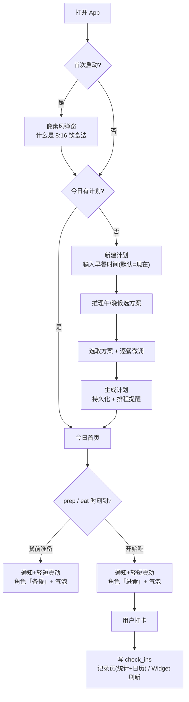

---

## 2. 首次启动引导（8:16 说明）

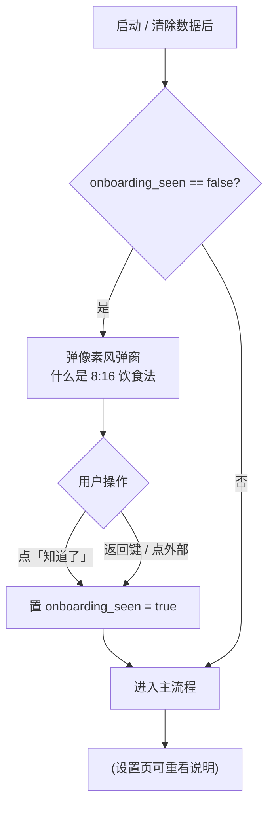

> 说明：弹窗文案只做客观解释，不做医疗功效承诺；跳过也视为已读（`onboarding_seen = true`），不强拦。

---

## 3. 新建计划流程

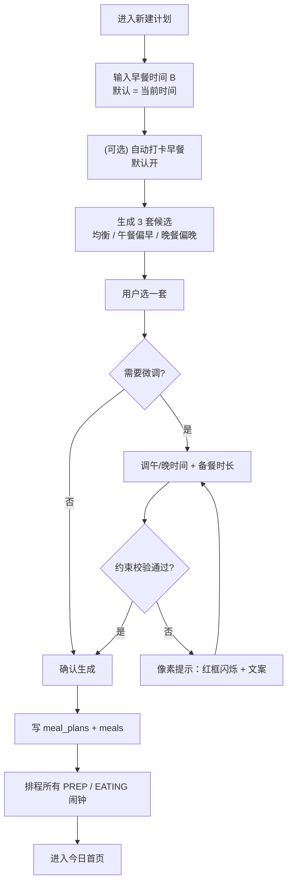

> 说明：早餐默认「记录即打卡」（记录早餐时间 = 已开始吃），故早餐无 PREP 阶段、备餐默认 0；该自动打卡可关。

---

## 4. 时间推理算法（候选生成）

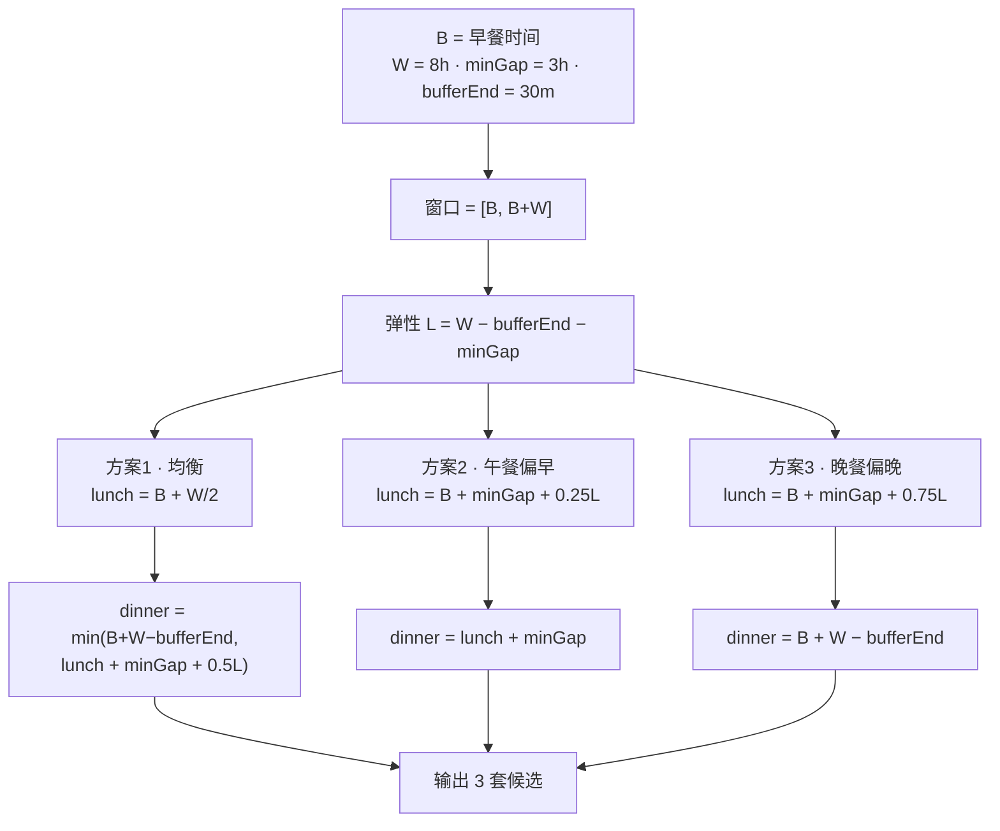

---

## 5. 餐次状态机

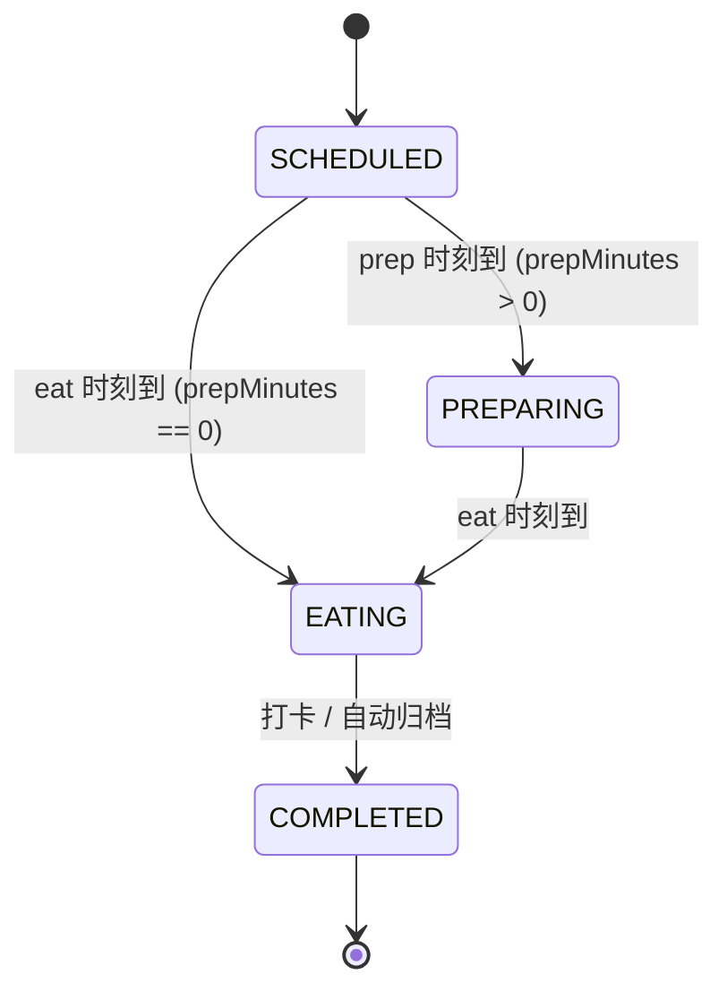

---

## 6. 提醒触发与调度

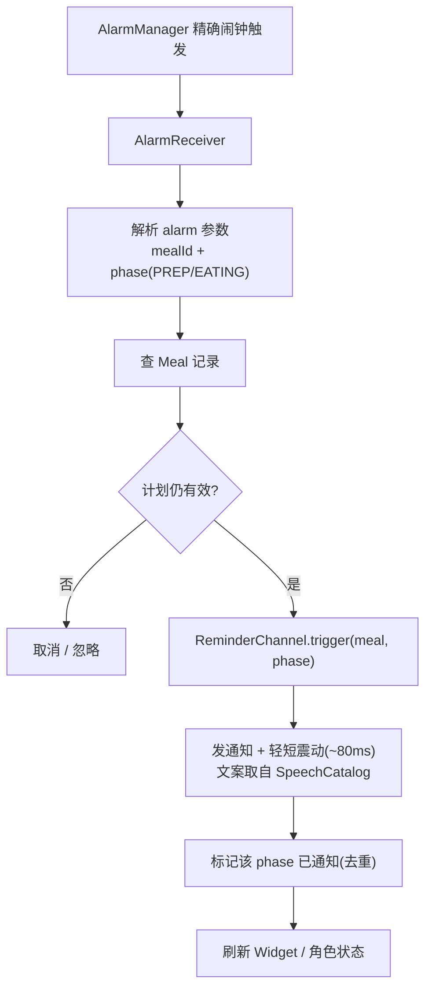

---

## 7. 重启 / 时区自愈

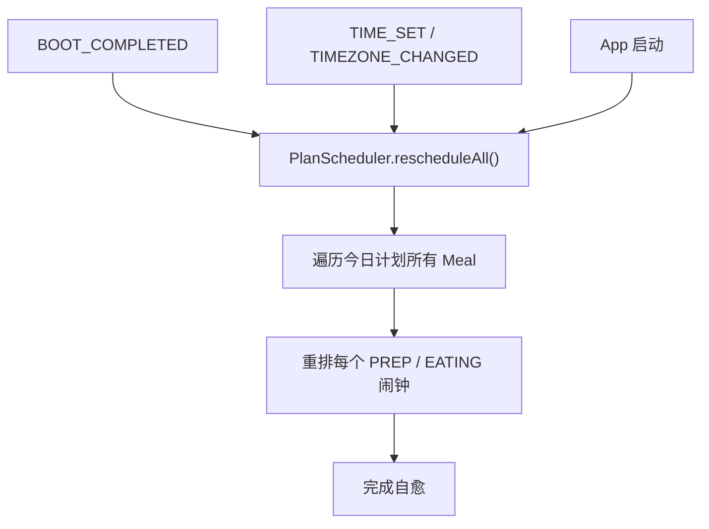

---

## 8. 打卡流程（三入口汇流）

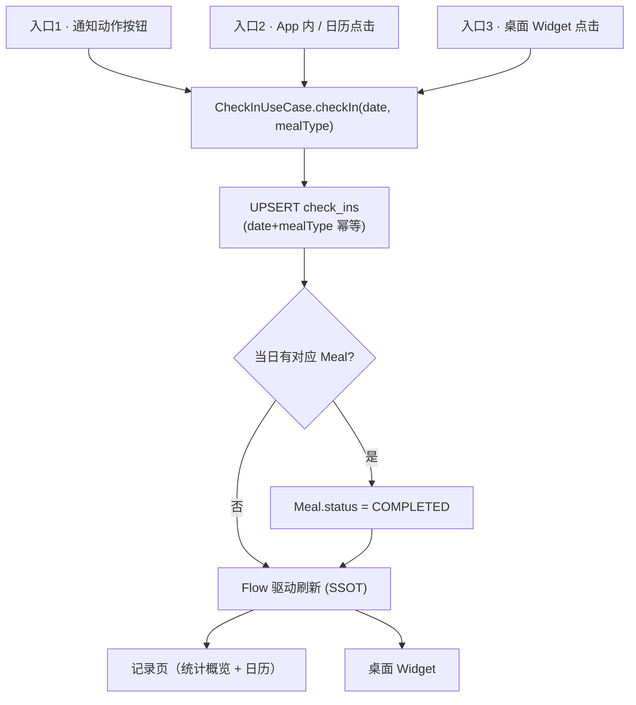

---

## 9. 角色状态派生

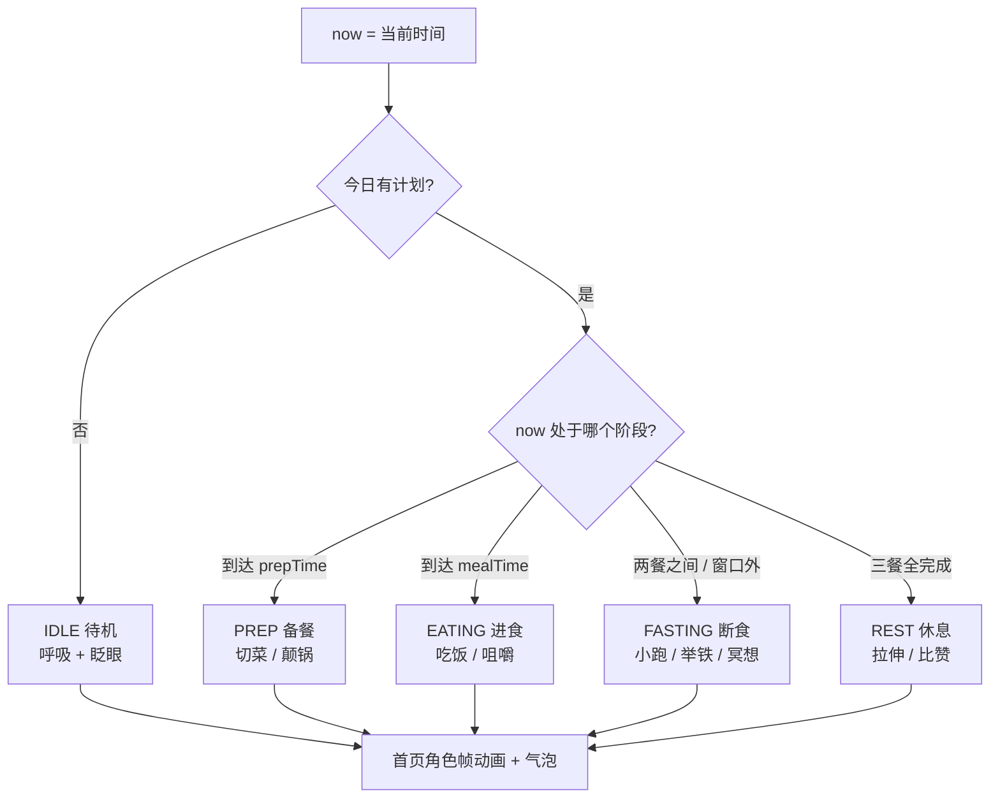

---

## 10. 连续打卡统计（Streak）

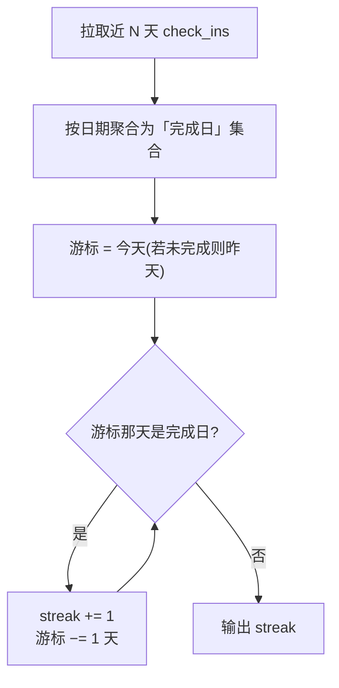

> 说明：「完成日」= 当日三餐均存在 check_ins 记录；连续用 gap 检测，逻辑在 `domain/stats/` 纯函数，可单测。

---

## 11. 桌面小组件更新

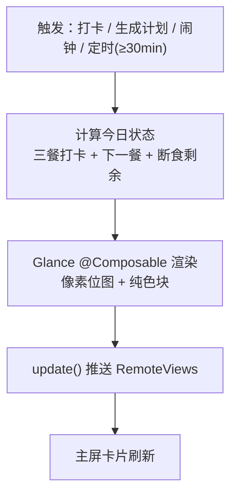

---

> 已按序展开：见 [[8-16饮食法App-完整定义]]（数据表 DDL / 算法伪码 / 页面组件与像素动效分镜）。
